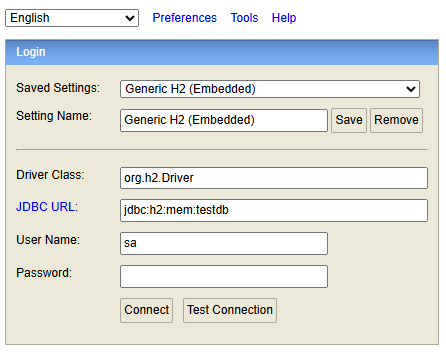

# Cars Rent Management

A **Car Rent Management Application** . This platform facilitates car leasing by acting as an interface between car owners and end customers while providing administrative control for managing the platform effectively.

## Overview

This application addresses the needs of the following personas:
1. **Car Owner**: 
   - Register and enroll their cars for leasing.
   - View car status (Idle, On Lease, On Service).
   - Access car lease history.
   
2. **End Customer**:
   - Register and view cars available for lease.
   - Start or end leases (maximum of 2 active leases at a time).
   - View personal lease history.
   
3. **Admin**:
   - Perform all operations available to car owners and customers for all registered cars and users.

---

## Key Features
- **CQRS Pattern**: Implemented to separate command and query responsibilities.
- **Modular Structure**: Organized as a multi-module Maven project for better maintainability.
- **In-memory Database**: Uses H2 database for simplicity and rapid testing.
- **API Documentation**: Integrated with Swagger for easy exploration of REST APIs.
- **Custom Logging**: Configurable log statements for better debugging and monitoring.
- **Extensibility**: Framework for adding features like third-party authentication, integration with external car portals, and exporting lease history reports.
- **Flyway**: Automatically manages database schema migrations. Flyway will create the necessary tables and seed mock data upon application startup.

---

## Tech Stack

### Backend
- **Language**: Java 21
- **Framework**: Spring Boot 3.3.0
- **Database**: H2 (in-memory database)
- **Dependencies**:
  - Spring Boot Starter Data JPA
  - Spring Boot Starter Web
  - Spring Boot Starter Security
  - Lombok
  - Springdoc OpenAPI
  - ModelMapper
  - Flyway (for automatic database schema creation and mock data population)

### Build Tool
- Maven (POM-based configuration)

---

## Getting Started

### Prerequisites
Ensure you have the following installed:
- JDK 21
- Maven 3.8+
- IDE with Spring Boot support (e.g., IntelliJ IDEA, Eclipse)

### Running the Application
1. Clone the repository:
   ```bash
   git clone <repository-url>
   cd cars-management

2. Build the project
   ```bash
   mvn clean install

3. Run the application
- Run the main application located in crm-api under the src/main/java/com/cars/management/CarsManagementMain class.
- Alternatively, use Maven to start the application ```mvn spring-boot:run

4. Access the following URLs:
- API Documentation: http://localhost:8081/swagger-ui/index.html#
- H2 Console: http://localhost:8081/h2-console/



5. Enable Lombok annotation process in ide.

### Default Admin Credentials
- Username: CarsAdmin
- Password: admin

### Flyway Setup
- Flyway is used to manage the database schema migrations.
- Upon startup, Flyway will automatically create the necessary database tables and also seed mock data into the database for testing and development purposes.
- You can customize Flyway migrations by adding SQL scripts to the crm-api/src/main/resources/db/migration/ directory.

### Testing
1. Run tests
    ```bash 
    mvn test

2. Test files:
    - Located in the crm-application/src/test/java directory under respective modules.

3. Test coverage:
    - View test coverage reports after running the tests.

